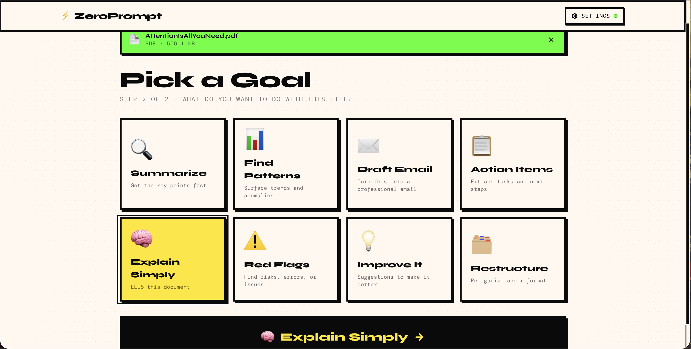
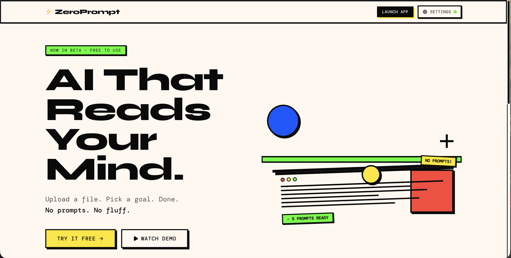
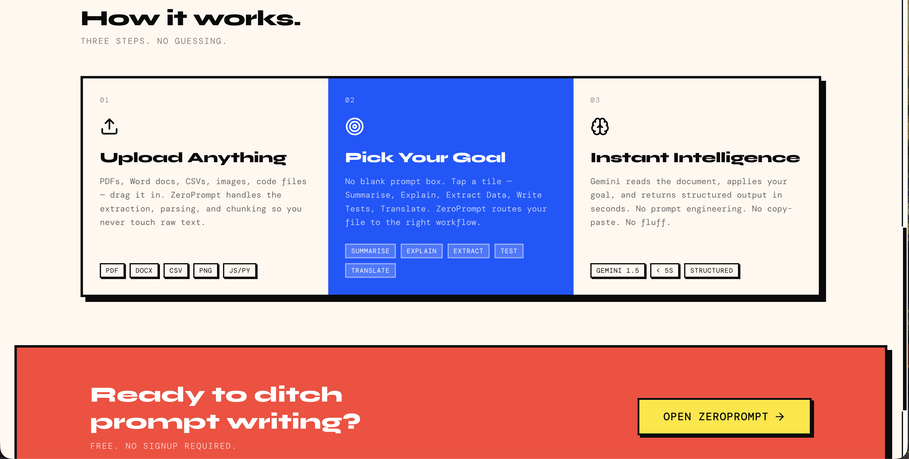

# ⚡ ZeroPrompt

Upload a file. Pick a goal. Get instant AI analysis — no prompt engineering required.

**[→ Try it live at zeroprompt-ai.vercel.app](https://zeroprompt-ai.vercel.app/)**

> No prompt required. Ever.

---

## Screenshots

### AI Output — Rich Markdown Result


### Pick a Goal


### Landing Page — Hero


### Landing Page — How It Works


---

## Tech Stack

| Layer | Technology |
|-------|------------|
| Framework | Next.js 14 (App Router) |
| Styling | Tailwind CSS + custom neo-brutalist design system |
| Animation | Framer Motion |
| AI | Google Gemini 2.5 Flash / Pro (via REST API) |
| File parsing | mammoth (DOCX), papaparse (CSV), native FileReader (PDF, images) |
| Icons | Lucide React |
| UI primitives | shadcn/ui |
| File drop | react-dropzone |

---

## Setup

```bash
# 1. Clone the repo
git clone https://github.com/praneethb7/zero-prompt.git
cd zero-prompt

# 2. Install dependencies
npm install

# 3. Start the dev server
npm run dev
```

Open [http://localhost:3000](http://localhost:3000), go to **Settings**, and paste your Gemini API key. Your key is stored only in `localStorage` — it never leaves your browser.

Get a free key at: https://aistudio.google.com/app/apikey

---

## Pages

| Route | Description |
|-------|-------------|
| `/` | Landing page |
| `/app` | Main tool — upload a file, pick a goal, get AI output |
| `/settings` | API key + model configuration |

## Supported Files

PDF · DOCX · CSV · TXT · MD · JS · TS · JSX · TSX · PY · PNG · JPG · WEBP · GIF

## Goals

Summarize · Find Patterns · Draft Email · Action Items · Explain Simply · Red Flags · Improve It · Restructure
